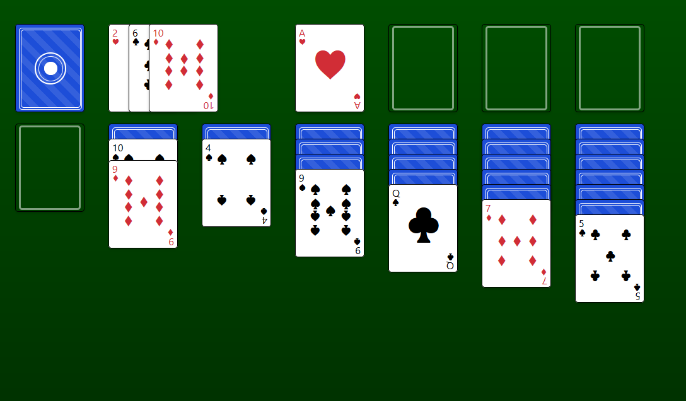

# React-Solitaire

A fun project to stretch my legs with React; a working game of solitaire. Uses [Atlassian's Pragmattic Drag and Drop](https://github.com/atlassian/pragmatic-drag-and-drop) for drag and drop functionality. 

Play it [https://solitaire.wyleconsesone.com/](Here!)

# How to Play
- Cards may be moved by dragging and dropping them onto either other cards, or an empty stack as appropriate.
- You can right-click a card to quickly send it to a stack if it is eligible.
- The goal is to create 4 organized pile of cards in the stacks at the top of the screen. These stacks are separated by their suits. Each of these stacks are organized from Aces to Kings, with an ace at the bottom of the stack and a king at the top. 
- At the start, cards are organized into columns at the bottom of the screen, and all remaining cards are left in the deck.
- The cards in the columns at the bottom may only be stacked in descending order. Additionally, their suits must be of alternating colors.